# Pipeline de importación — Lumik Desktop

Flujo desde que el usuario confirma la importación hasta que las fotos
quedan registradas en la base de datos con thumbnails en caché.

```mermaid
flowchart TD
    START([Usuario confirma importación])
    START --> SETTINGS[Leer AppSettings y metadatos\ndel fotógrafo desde global DB]

    SETTINGS --> WORKSPACE[Crear workspace temporal\n/tmp/ProyectoName_ts/raw/\n/tmp/ProyectoName_ts/dng/]

    WORKSPACE --> CONVERT_CHECK{convert_to_dng?}

    CONVERT_CHECK -- Sí --> COPY_RAW["FASE 1A — Copiar a /raw/\nfs::copy × N (secuencial)\nfuente → /tmp/.../raw/"]
    COPY_RAW --> DNGLAB["FASE 1B — dnglab convert\n(un solo proceso, todos los archivos)\n/tmp/raw/ → /tmp/dng/"]

    CONVERT_CHECK -- No --> PASSTHROUGH["FASE 1 — Passthrough\nfs::copy × N (secuencial)\nfuente → /tmp/.../dng/"]

    DNGLAB --> EXIFTOOL_META
    PASSTHROUGH --> EXIFTOOL_META

    EXIFTOOL_META["FASE 2A — exiftool rename + embed\n(un solo proceso, directorio completo)\n· Renombra: AAAA-MM-DD__HH-MM-SS__Proyecto_NNN\n· Escribe: Artist, Copyright, ContactURL en XMP"]

    EXIFTOOL_META --> MOVE["FASE 2B — Mover al disco externo\nfs::copy + remove × N (secuencial)\n/tmp/dng/ → /mount/lumik/Proyecto/\nNota: copy+delete porque rename()\nno funciona cross-filesystem"]

    MOVE --> CLEANUP[Limpiar workspace temporal]

    CLEANUP --> BATCH_EXIF["FASE 3A — Batch EXIF\nexiftool -csv file1 file2 … fileN\n(UN solo proceso para N archivos)\nDevuelve HashMap PathBuf → FileMetadata\n11 tags: width, height, date, make, model,\niso, fnumber, exptime, expcomp, focal, lens"]

    BATCH_EXIF --> BUILD_DTOS["Construir CreatePhoto DTOs\nPara cada archivo:\n· file_size = fs::metadata().len() — sin leer el archivo\n· meta = exif_map.get(path)"]

    BUILD_DTOS --> TRANSACTION["FASE 3B — Transacción SQLite única\nBEGIN\n  INSERT INTO photo × N\nCOMMIT\n(antes: N transacciones individuales)"]

    TRANSACTION --> TRANS_OK{¿Éxito?}

    TRANS_OK -- Sí --> THUMB["FASE 3C — Thumbnails paralelos\nchunks de min(CPUs, 8) threads simultáneos\nCada thread: exiftool -b -ThumbnailImage\n→ .thumbs/{photo_id}.jpg"]
    TRANS_OK -- Error --> FAIL_ALL["Todos los archivos\nmarcados como fallidos\nen ImportResult"]

    THUMB --> DONE([✓ ImportResult\n· successful: N\n· failed: 0])
    FAIL_ALL --> DONE_FAIL([✗ ImportResult\n· successful: 0\n· failed: N])
```

## Notas de rendimiento

| Paso | Antes | Después |
|------|-------|---------|
| Extracción EXIF | 1 proceso `exiftool` × N fotos | 1 proceso `exiftool` para todas |
| Thumbnails | 1 proceso `exiftool` × N fotos, secuencial | Paralelo en chunks de hasta 8 threads |
| Hash SHA-256 | `fs::read` completo del DNG + SHA-256 (sin usar) | Eliminado |
| File size | `dng_bytes.len()` (requería leer el archivo) | `fs::metadata().len()` (syscall) |
| INSERTs en BD | N transacciones individuales | 1 transacción con N INSERTs |

## Bottleneck restante

El paso más lento es la **copia cross-filesystem** (Fase 2B): los DNG de 30-80 MB
deben copiarse al disco externo. `rename()` no funciona entre particiones distintas,
por lo que es un `copy + delete` inevitable. Está limitado por el throughput del disco
externo (típicamente USB 3.0 = ~300 MB/s).
